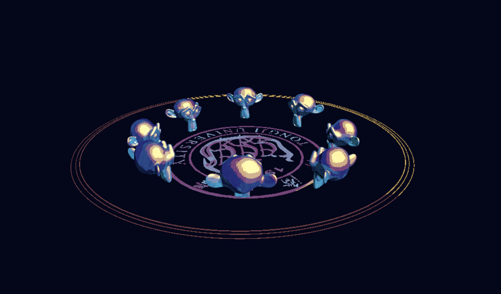

# Unity-SoundVisualizationUnity

**Unity 声音可视化网页交互项目**  

[点击前往在线演示界面](https://hannahhu.itch.io/singforme)

---
## 技术信息

- **开发环境**：Unity6 URP
- **平台**：WebGL  
---
## 功能介绍

**实时声音交互**  
   - 打开麦克风权限，对着麦克风出声：  
     - 猴头模型随声音变形  
     - 底部圆圈随声音扩张  
     - 光源位置随声音变化，使自制材质实现美妙的光影变化  
---

## 使用说明

- GitHub 上只上传了：
  - 控制声音可视化实现的C# 脚本  
  - 本项目中使用的 WebGL 麦克风插件
- **还未上传**：
  - 模型文件、材质文件  
- 材质文件会上传的，我照着大神的思路研究了很久才做出来这个材质的现在这一版，想等再改进的好一些再和大家分享
- 模型用的就是blender的苏珊娜，大家自己整一个应该也很容易，所以就没放在这里了。
- 普通大学生的普通作业，做的不是很好也发出来了，见谅见谅。

## 致谢

- 本项目使用的 WebGL Microphone 插件修改自 [github.com/tgraupmann/UnityWebGLMicrophone](https://github.com/tgraupmann/UnityWebGLMicrophone)，遵循 MIT License。感谢你，你真是大好人。
- 感谢 [YouTube 教学视频](https://www.youtube.com/watch?v=uwCjzUTpR1E) 提供的unity声音可视化教学和FrequencyBandAnalyser脚本，感谢你们，你们真是大好人。
- Shader 制作灵感参考 [StylizedPaintShaderbreakdown](https://cyn-prod.com/stylized-paint-shader-breakdown) 博客，目前我在unity中使用纯shader+贴图终于复刻成功了大约 30% 的效果，就已经把我迷的五迷三道了，非常漂亮，佩服大神，感谢你，你真是大好人。

---

